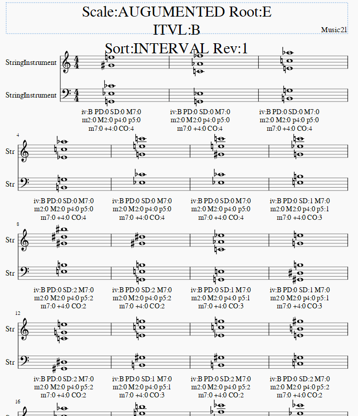

# voicing explorer

Generate music score which lists the all possibilities of voicing of the given scale.

## Description

Although to a find good voicing is very crucial part of music composition, the number of possibilities of voicings increase as number of notes increase.

This tiny program helps composers to find "uncommon but cool" voicings by listing all possibilities of voicings under user specified conditions.

Voicing rules are based on "Herb Pomeroy, Line Writing" rules, but you can modify the rules by adding/deleting conditions of  "check_interval" function in vex.py

## Features

- Generates score of all possibilities of chord voicings with given parameters as arguments.
- User can specify
  - Scale Name (IONIAN,DORIAN...refer to scales variable in scale.py)
  - Root Note (C,C#,Db,D...)
  - Optional
    - Show only specified Top and Bottom Note (C,C#,Db,D...)
    - Show only voicings which include Maj7 interval. (Since it sounds cool)
    - Show only voicings which include PD (primary dissonant, Maj7, min2)
    - Show only voicings which exclude PD
    - Show only voicings with certain range of top-bottom degree (SMALL less than 10th, MEDIUM 10th to 2oct, LARGE more than 2oct)
    - Sorting

## Requirement

- Python3
- music21 ver5 + MuseScore
- itertools

## Usage

python vex.py Root Scale [options]

- Root
  - C,C#,Db,D...
- Scale 
  - IONIAN,DORIAN...refer to scales variable in scale.py
- Options
  - -t
    - Show only specified Top note (C,C#,Db,D...)
  - -b
    - Show only specified Bottom note (C,C#,Db,D...)
  - -m
    - Show only voicings which include Maj7 interval.
  - -p
    - Show only voicings which include PD (primary dissonant, Maj7, min2)
  - -c
    - Show only voicings which exclude PD
  - -i
    - Show only voicings with certain range of top-bottom degree (0:SMALL, 1:MEDIUM, 2:LARGE)
      - SMALL: less than 10th,
      - MEDIUM: 10th to 2oct,
      - LARGE: more than 2oct)
  - -s
    - Sorting Method.
      - INTERVAL
        - top bottom interval
      - PD
        - number of PD
      - TOP_NOTE
      - BOTTOM_NOTE
      - MAJ7
        - number of MAJ7 degree
      - SECOND
        - number of Maj2,min2 degree
      - CONSONANCE
        - number of consonance
      - P5
        - number of perfect 5 degree
  - -r
    - reverse sorting (0,1)
  - -l
    - Length of each voicing , default is 4=quarter note. 
  - -v
    - Number of voices, default is 5

​	

for example

python vex.py E AUGUMENTED -s INTERVAL -r 1 -i 2

- Root Note is E
- Scale is AUGUMENTED
- Sort by interval  with reverse
- Show only LARGE voicings

generates following result.

## Installation

Not needed. Just call from python3.

## Author

delphinus1024

## License

[MIT](https://raw.githubusercontent.com/delphinus1024/voicing_explorer/master/LICENSE.txt)

